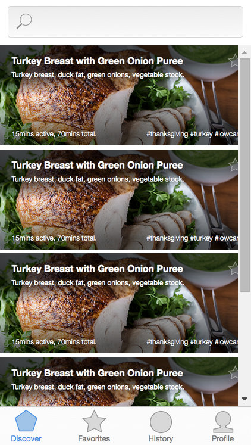
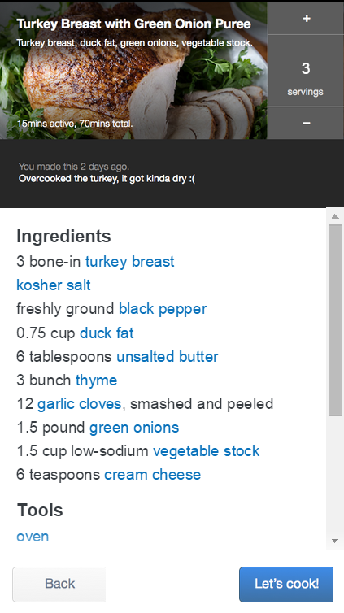
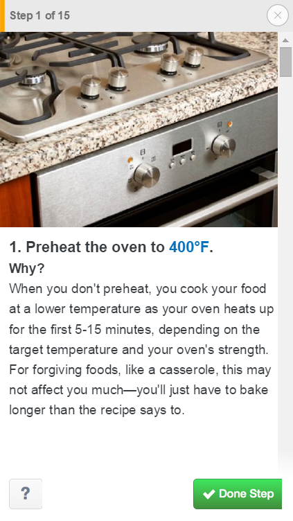
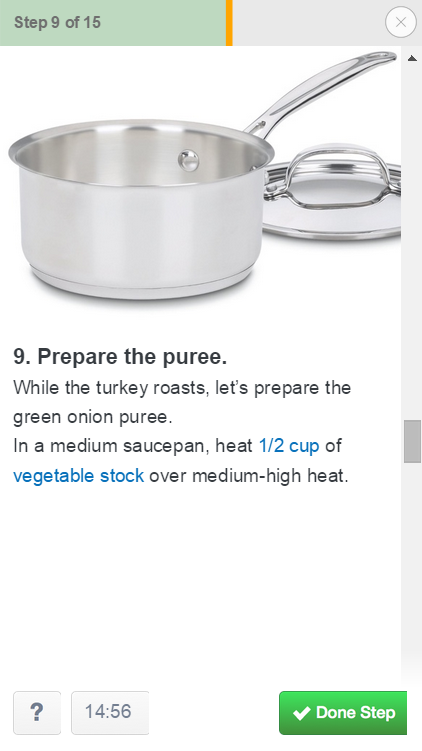
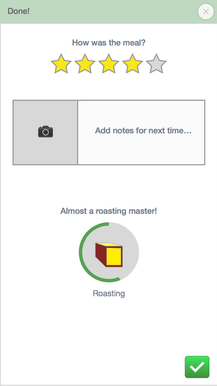

<<<<<<< HEAD
<<<<<<< HEAD
## Sous-Chef

Prototype of a cooking app built as part of a HCI (Human-Computer Interation) project.  
Built using [framer.js](http://framerjs.com/).  
Works only in Google Chrome

#### Features
* In-line unit conversion
* Dynamic measurements
* Context-based cooking timer

#### Demo
[Demo](http://ajitpawar.github.io/Sous-Chef/)

   
   
   
   

=======
=======
>>>>>>> e1fe045a2533cb2fdf169c8b223a35942dfa05bf
This is a prototype for a cooking app made for an HCI course "CSC318 Design of Interactive Computational Media" at the University of Toronto.

It's built using [framer.js](http://framerjs.com/).

[Demo (coming soon)](https://github.com/AjitPawar/cooking-app#)
<<<<<<< HEAD
>>>>>>> live demo
=======
>>>>>>> e1fe045a2533cb2fdf169c8b223a35942dfa05bf
